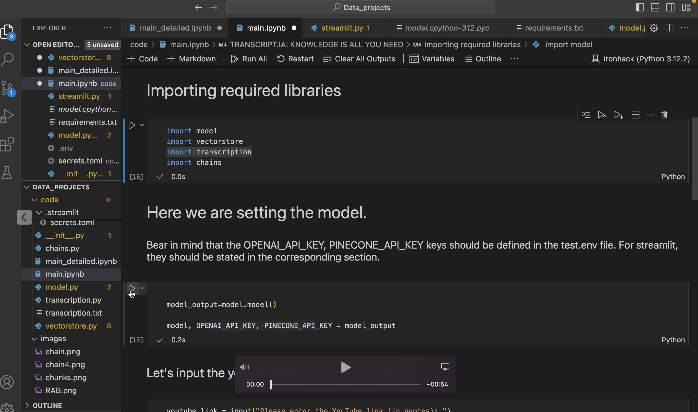

# Building a RAG application from scratch

The following projects consists on a system that transcripts videos from youtube and enables users to interact with it through questions. It's built using LangChain, GPT4 and a simple RAG (Retrieval-Augmented Generation) application using Pinecone and OpenAI's API. The application will allow you to ask questions about any YouTube video.


## Content

1. main_detailed.ipynb: this is the comprehensive notebook that includes testings, detailed explanations and so on. Designed to walk users through the process.

2. main.ipynb. Main notebook that centralizes all encapsulated functions built within the other .py files: transcription.py, vectorstore.py, model.py and chains.py.

3. Streamlit: Amazing app created by Miguel to make it easier for users to play around with the model.

### Short tutorial on how to run it:


[](https://youtube.com/watch?v=Ym1b8ZgOM14&ab_channel=MiguelPalosPou)

https://youtube.com/watch?v=Ym1b8ZgOM14&ab_channel=MiguelPalosPou
## Setup

1. Create a virtual environment and install the required packages:

```bash
$ python3 -m venv .venv
$ source .venv/bin/activate
$ pip install -r requirements.txt
```

2. Create a free Pinecone account and get your API key from [here](https://www.pinecone.io/).

3. Create a `.env` file with the following variables:

```bash
OPENAI_API_KEY = [ENTER YOUR OPENAI API KEY HERE]
PINECONE_API_KEY = [ENTER YOUR PINECONE API KEY HERE]
PINECONE_API_ENV = [ENTER YOUR PINECONE API ENVIRONMENT HERE]
```
